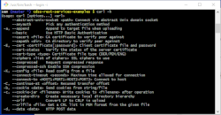
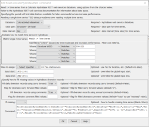

# cdss-rest-services-examples #

This repository contains examples to access data from HydroBase REST web services
using various tools and technologies.
This project enhances information that is presented on the 
[Technical Information & Help](https://dwr.state.co.us/rest/get/help#TechInfoHelp) page.
The goal of this project is to provide technical examples in a way that can be understood
by wide audience of users and streamline implementing tools to consume data from the web services.

* [Introduction](#introduction)
* [Examples](#examples)
* [Repository Contents](#repository-contents)
* [Development Environment](#development-environment)
* [License](#license)
* [Contributing](#contributing)
* [Maintainers](#maintainers)
* [Release Notes](#release-notes)

------------------

## Introduction ##

Colorado's HydroBase REST web services implement
[Representational State Transfer (REST)](https://en.wikipedia.org/wiki/Representational_state_transfer) web service design.
In general terms, this means that each URL provided by web services corresponds to a unique data resource.
The web service URLs correspond to major datasets available in HydroBase, typically tables and views in the database.
The uniqueness of a URL and corresponding data can be refined by adding query parameters.
Each web service provides a default behavior and can be further configured by providing query parameters in the URL:

* Query parameters follow the `?` character in the URL.
* Each query parameter includes a parameter name, `=`, and value, and value can take on various forms depending on the data type.
* Query parameters are separated by `&` character.
* The [Url Generator](https://dwr.state.co.us/rest/get/help) links on the HydroBase web service page help format URLs for the data resource being queried and corresponding query parameters.
* Default web service query limits are enforced and require an API key to increase limits above the defaults.
See the [Technical Information & Help](https://dwr.state.co.us/rest/get/help#TechInfoHelp).

The REST web services can be called by various technologies and tools, as illustrated in the examples on this page.
In some cases, basic data retrieval occurs (e.g., using `curl`).
In other cases (e.g., TSTool), a tool may add value by streamlining use of the web service,
integrating several web services, and providing additional useful features.

The following should be considered when using web services:

* Web services are convenient because public access to HydroBase can be provided without installing a local HydroBase database.
However, Web services are typically slower than direct database queries because of layers of communication and data formatting.
Therefore, heavy data users should consider breaking workflows into a download step,
and separate processing step that can be rerun without having to download data again.
* Web services are a "snapshot in time".  Therefore, if it is important to have a timestamped version of the data,
downloaded files should be saved to a local computer with an appropriate date.
* Software that has traditionally used HydroBase data, such as TSTool and StateDMI,
may not be able to provide the same features because web services do not provide all needed data.
It is expected that web services will be enhanced over time and will allow such tools to offer
web services as an option for data access.
* Like any website, web services may at times experience downtime.
* Changes to web services may impact software that uses the web services.
However, because the web service API is documented, such impacts should be relatively easy to troubleshoot.

## Examples ##

This repository contains examples illustrating how to access HydroBase REST web services
using various tools and technologies.

| **Tool / Technology** | **Description** |
| --------------------- | --------------- |
| [ArcGIS](examples/arcgis/README.md) | ArcGIS Geographic Information System (GIS) software. |
| [curl](examples/curl/README.md)<br>[](examples/curl/README.md) | `curl` command line tool to retrieve data and save to local file. |
| [Excel](examples/excel/README.md) | Microsoft Excel workbook examples. |
| [Google Sheets](examples/googlesheets/README.md) | Google Sheets, online spreadsheets. |
| [JavaScript](examples/javascript/README.md) | JavaScript, used for web application development. |
| [Python](examples/python/README.md) | Python programming language, used to automate data processing. |
| [R](examples/r/README.md) | R programming language, used to automate data processing for statistical analysis. |
| [StateDMI](examples/statedmi/README.md)| StateDMI software (part of Colorado's Decision Support Systems), used to automate creation of StateCU and StateMod model files. |
| [TSTool](examples/tstool/README.md)<br>[](examples/tstool/README.md) | TSTool software (part of Colorado's Decision Support Systems), used to automate time series and other data processing. |

## Repository Contents ##

The repository contains the following folders and files.
Currently, README files are used to present information,
but the content may be converted to a GitHub page, Wiki, or some other form in the future.
`README.md` files provide information and can be viewed in the repository using a web browser.

```text
cdss-rest-services-examples/  Repository name and main folder.
  .github/                    Files specific to GitHub such as issue template.
  .gitattributes              Git configuration file.
  .gitignore                  Git configuration file.
  README.md                   This file.
  examples/                   Main examples folder
    arcgis/                   ArcGIS examples.
    curl/                     Curl/script examples.
    excel/                    Excel examples.
    googlesheets/             Google sheets examples.
    javascript/               JavaScript API and examples.
    python/                   Python examples.
    r/                        R examples.
    statedmi/                 StateDMI examples.
    tstool/                   TSTool examples.
```

A recommended (but not required) folder structure to contain the repository files on the local computer is as follows.
This folder structure is consistent with other CDSS products, and provides consistency and flexibility.
Examples are constructed to work using relative paths or absolute paths that are dynamically determined
from the local files.

```
C:\Users\user\                         Windows user files.
  cdss-dev/                            CDSS development files.
    REST-Examples/                     This product.
      git-repos/                       Git repositories for the website.
        cdss-rest-services-examples/   The repository files, as shown above.
```

## Development Environment ##

The development environment for examples varies by the technology that is used.
Additional information will be provided as the examples are implemented.

## License ##

The license for this documentation is the [Creative Commons CC-BY 4.0 license](LICENSE.md).
Examples that are implemented in software code are distributed using GPL v3 license.

## Contributing ##

See the [OpenCDSS Licensing](http://opencdss.state.co.us/opencdss/licensing/) documentation.

## Maintainers ##

This repository is maintained by the OpenCDSS team in coordination with
Colorado Water Conservation Board and Colorado Division of Water Resources staff.

## Release Notes ##

The following are major updates for the repository and examples.
See the GitHub issues for details.

* 2019-09-06 - Add initial TSTool and `curl` examples.
* 2019-08-12 - Initialize the repository.
