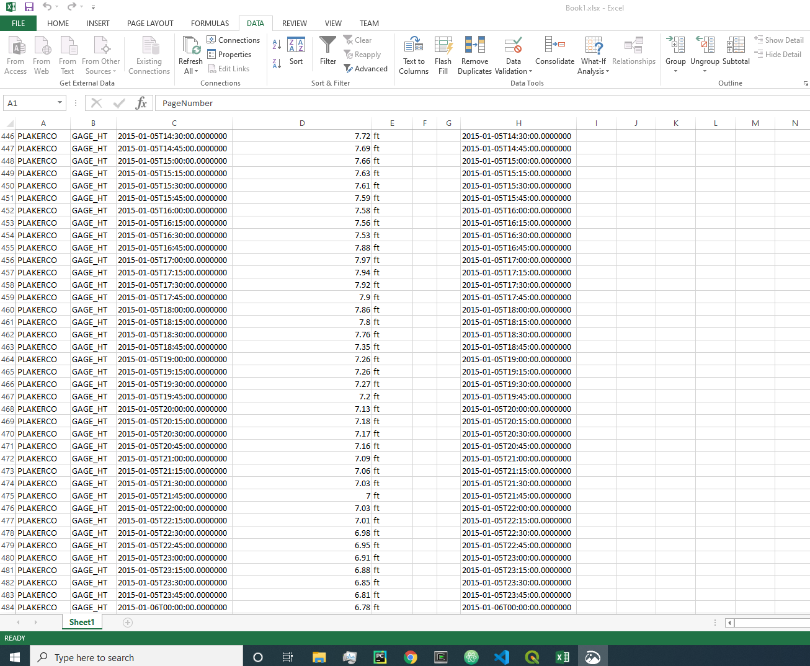

# examples/excel

This folder contains examples of how to link Microsoft Excel to the State of
Colorado's HydroBase REST web services.

See also the example on the
[HydroBase REST Web Services website](https://dwr.state.co.us/rest/get/help#TechInfoHelp&#All&#gettingstarted&#jsonxml).

## Importing data to Excel from the CDSS REST Services

### Calling the query URL from a web Browser

A URL can be generated to query the HydroBase Web Service at 
[Colorado's Decision Support System's](https://dwr.state.co.us/Rest/GET/Help)
website. For example, a Telemetry Time Series Raw URL can be created
[here](https://dwr.state.co.us/Rest/GET/Help/TelemetryTimeSeriesRawGenerator).
Using a browser of choice, paste the URL into the search bar containing csv as the
format, and a .csv (comma separated values) file will be downloaded on the local
machine.

From here click the Data tab, then From Text and select the downloaded file from
the file system to import to Excel. Below is an example of a query using the
PLAKERCO Telemetry Station, using the GAGE_HT parameter during the period between
01/01/2015 and 01/06/2015.

