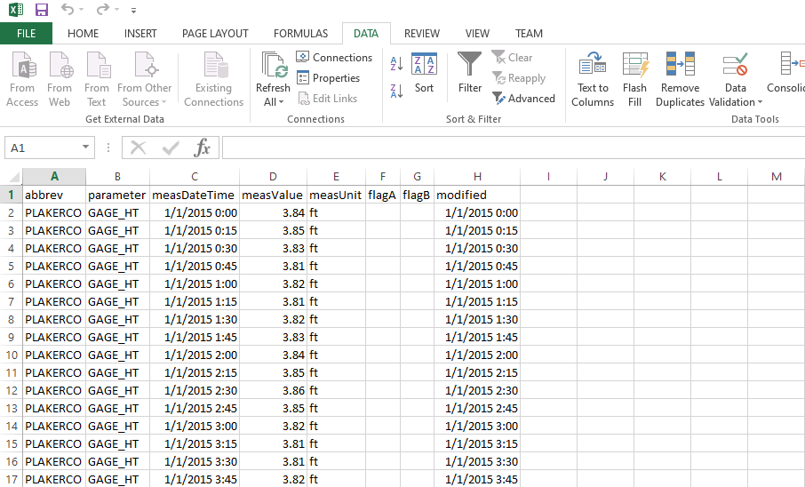

# examples/excel

This folder contains examples of how to link Microsoft Excel to the State of
Colorado's HydroBase REST web services.

See also the example on the
[HydroBase REST Web Services website](https://dwr.state.co.us/rest/get/help#TechInfoHelp&#All&#gettingstarted&#jsonxml).

The following sections provide a summary of the project and instructions for
getting started:

* [Excel Example Folder Structure](#excel-example-folder-structure)
* [Importing Data to Excel from the CDSS REST Services](#importing-data-to-excel-from-theo-cdss-rest-services)
* [Calling the Query URL from a Web Browser](#calling-the-query-url-from-a-web-browser)
* [Using Excel from a Web Page](#using-excel-from-a-web-page)
* [Using Another Example from this Repository](#using-another-example-from-this-repository)

## Excel Example Folder Structure
```text
C:\Users\user\                             User's home folder, Windows style.
/c/Users/user/                             User's home folder, Git Bash style.
/cygdrive/C/Users/user/                    User's home folder, Cygwin style.
/home/user/                                User's home folder, Linux style.
  cdss-dev/                                Work done on Colorado Decision Support Systems projects.
```

This repository and Excel example contains the following:
```text
cdss-rest-services-examples/               The top-level CDSS example repository file.
  examples/                                The directory with all CDSS web services examples.
    excel/                                 Top-level directory for this Excel example.
      GAGE_HT_PLAKERCO_PYTHON_RAW.xlsx     Excel example Book showing data retrieved by Python from the HydroBase web service.
      GAGE_HT_PLAKERCO_RAW.xlsx            Excel example Book showing data returned straight from a HydroBase query URL.
      README.md                            This README file.
```


## Importing Data to Excel from the CDSS REST Services
[Excel](https://products.office.com/en-us/excel) is a spreadsheet program
created by Microsoft. It's used to create grids of text, numbers and formulas
specifying calculations, among many other things.

**Note:** There are two images below showing examples of Excel Books with a query
to the HydroBase web service. Both of these can be downloaded. If this repository
is cloned, the two .xlsx files in this example folder can be opened in Excel to
view. Otherwise, either can be clicked above, which will "show" the file as an
executable. One of the options on this new page is a download button to download
the files separately instead of having to pull down the entire repo.

----
### Calling the Query URL from a Web Browser

A URL can be generated to query the HydroBase Web Service at the 
[Colorado's Decision Support System](https://dwr.state.co.us/Rest/GET/Help)
website. For example, a Telemetry Time Series Raw URL can be created
[here](https://dwr.state.co.us/Rest/GET/Help/TelemetryTimeSeriesRawGenerator).
Using a browser of choice, paste the URL into the search bar containing csv as the
format, and a .csv (comma separated values) file will be downloaded on the local
machine.

From here click the DATA tab, then From Text and select the downloaded file from
the file system to import to Excel. Below is an example of a query using the
PLAKERCO Telemetry Station, using the GAGE_HT parameter during the period between
01/01/2015 and 01/06/2015.

****

****
The full example of the Excel Book is in this folder under the file name
`GAGE_HT_PLAKERCO_RAW.xlsx`

### Using Excel to Query from a Web Page

Excel can create a query that imports data from the web. It does not come
default on Excel 2013 (or older) but does on Excel 2016. Microsoft has a well
made introduction tutorial on the Office support website [here](https://support.office.com/en-us/article/power-query-101-008b3f46-5b14-4f8b-9a07-d3da689091b5).

### Using Another Example from this Repository

Another option is to use another technology example from this repository to
retrieve the data, and then import into Excel. For instance, take the Python
example. It can be used to query the data, create a CSV file, then send it to
Excel. What's nice about running the Python, is that it takes care of a couple
things behind the scenes:

1. As can be seen in the Excel image above, when querying the Web Services
from the CDSS itself, some metadata is returned that is not really wanted nor
needed for the remaining results. When queried, the HydroBase returns the 
entire response object; So when the results are written and saved to a file,
that is what's being opened and displayed in the Excel Book. The Python example
will discard these rows.

2. Since the Web Services returns all data as is, dates and times are returned
with very high precision, and are difficult to read and unnecessary in some
cases. In the Python example created Excel Book below, the dates and times
are manipulated to still have accuracy while also being more user friendly.

3. When using Python, the streamflow program that fetches the data takes care
of something called paging. Sometimes queries can be quite large, and if the
amount of data "rows" retrieved exceeds 50,000, the Web Service will respond
in multiple pages. This means that even though the user may think at first all
data has been fetched, in reality only the first of X amount of pages have
been returned.<br>Unless a user is familiar with paging and makes multiple
queries with the page indexes, figuring paging out can be a hassle. Luckily,
the Python program takes care of paging, and returns back however
many pages are generated due to the query.

Instructions for running the Python example can be found at its
[README](../python/README.md) page in its repository.

Similar to the URL query above, import the downloaded CSV file into Excel
by opening Excel, clicking the DATA tab, then the From Text option below it.
Select the CSV file from the file system to import and follow the instructions.
Using the same GAGE_HT parameter, PLAKERCO Telemetry Station, and time period
between 01/01/2015 and 01/06/2015, the output in the Excel Book is quite a bit
more readable. The first two metadata lines are gone, since they won't be needed.
The Python program discards them, making the headers more easily distinguishable
as the only non-data row in the data set. The dates and times are also in a better
format for interpreting, as seen below.

****

****
The full example of the Excel Book is in this folder under the file name
`GAGE_HT_PLAKERCO_PYTHON_RAW.xlsx`

