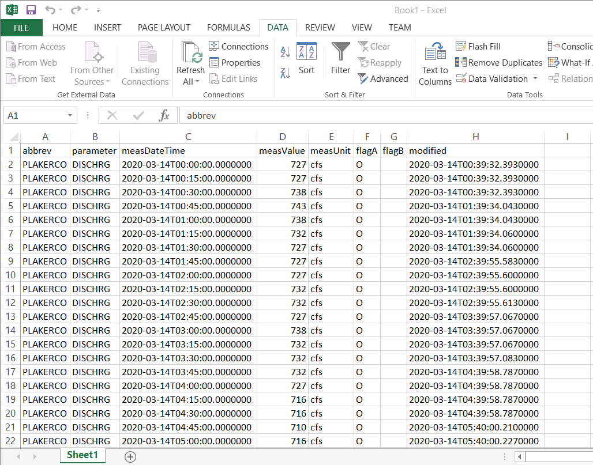

# examples/excel

This folder contains examples of how to link Microsoft Excel to the State of
Colorado's HydroBase REST web services.

See also the example on the
[HydroBase REST Web Services website](https://dwr.state.co.us/rest/get/help#TechInfoHelp&#All&#gettingstarted&#jsonxml).

The following sections provide a summary of the project and instructions for
getting started:

* [Excel Example Folder Structure](#excel-example-folder-structure)
* [Importing Data into Excel from the CDSS REST Services](#importing-data-into-excel-from-the-cdss-rest-services)
	+ [Importing a CSV from a Web Browser Download](#importing-a-csv-from-a-web-browser-download)
	+ [Using Excel to Query from a Web Page](#using-excel-to-query-from-a-web-page)
	+ [Using Excel with Another Technology in this Repository](#using-excel-with-another-technology-in-this-repository)

-------

## Excel Example Folder Structure
```text
C:\Users\user\                             User's home folder, Windows style.
/c/Users/user/                             User's home folder, Git Bash style.
/cygdrive/C/Users/user/                    User's home folder, Cygwin style.
/home/user/                                User's home folder, Linux style.
  cdss-dev/                                Work done on Colorado Decision Support Systems projects.
    cdss-rest-services-examples/           This repository's files.
```

This repository and Excel example contains the following:
```text
cdss-rest-services-examples/               The top-level CDSS example repository file.
  examples/                                The directory with all CDSS web services examples.
    excel/                                 Top-level directory for this Excel example.
      DISCHRG_PLAKERCO_RAW.xlsx            Excel example Book showing data returned from a HydroBase query URL.
      GAGE_HT_PLAKERCO_PYTHON_RAW.xlsx     Excel example Book showing data retrieved by Python from the HydroBase web service.
      GAGE_HT_PLAKERCO_RAW.xlsx            Excel example Book showing data returned from a HydroBase query URL.
      README.md                            This README file.
```

## Importing Data into Excel from the CDSS REST Services

[Excel](https://products.office.com/en-us/excel) is a spreadsheet program
created by Microsoft. It's used to create grids of text, numbers and formulas
specifying calculations, among many other things.
Different versions of Excel are available, including desktop Excel versions,
Microsoft Office 365 online subscriptions, etc.
The underlying features are similar.

**Note:** There are two images below showing examples of Excel workbooks with a query
to the HydroBase web service. Both of these workbooks can be downloaded from the repository
and opened on the computer or the repository can be cloned.
Web browsers behave differently when clicking on an Excel file in a website.

### Importing a CSV from a Web Browser Download ###

This example explains how to import a comma-separated-value (CSV) file into Excel
that has been downloaded using a web browser.

A URL can be generated to query the HydroBase Web Service by using the 
[Colorado's Decision Support System](https://dwr.state.co.us/Rest/GET/Help) website.
For example, a Telemetry Time Series Raw URL can be created
[here](https://dwr.state.co.us/Rest/GET/Help/TelemetryTimeSeriesRawGenerator).
Using a browser of choice, paste the URL into the browser search bar and query the page.
Make sure to indicate that the format is `csv` so that
comma separated value file will be downloaded to the local machine.
CSV is used because its tabular form imports directly into Excel.
For example, use the following URL:

```
https://dwr.state.co.us/Rest/GET/api/v2/telemetrystations/telemetrytimeseriesraw/?format=csv&abbrev=PLAKERCO&parameter=DISCHRG
```

In Excel, click the ***DATA*** tab, then ***From Text*** and select the downloaded file from
the file system to import to Excel, an auto-generated filename such as:

```
DWR_REST_TelemetryStations_TelemetryTimeSeriesRawDMs_202004130046_.csv
```

The first two lines of the CSV file will cause issues because they indicate paging information.
Therefore, in the import wizard, specify the following information and
otherwise use defaults:

* ***Original data type*** - choose ***Delimited***
* ***Start import at row*** - `3`
* ***My data has headers*** - select this since row 3 has headers
* ***Delimiters*** - select ***Comma***
* The ***Import Wizard*** can also be used to explicitly specify the column data types.

Below is an example of a query using the
PLAKERCO Telemetry Station, using the DISCHRG parameter for a recent period.



The Excel workbook can then be saved.
The full example of the Excel Book is saved in the repository as
`DISCHRG_PLAKERCO_RAW.xlsx`

### Using Excel to Query from a Web Page

The previous example performed the query in the web browser and then
Excel imported the file saved from the web browser.
Another option is for Excel to query directly from the web.
Use the ***DATA / From Web*** tool and enter a URL such as the example in the previous section.

* See more information in the [Power Query 101 Tutorial](https://support.office.com/en-us/article/power-query-101-008b3f46-5b14-4f8b-9a07-d3da689091b5).

### Using Excel with Another Technology in this Repository

Another option is to use another technology example from this repository to
retrieve the data, and then import into Excel.
The following leverages the Python example.
Python can be used to query the data and create a CSV file that can be imported into Excel.
Python handles the following technical issues:

1. CSV returned from the web services contain an extra metadata line containing the record count
and query time, which are useful but not part of the data.
The Python code strips these lines from the data representation.

2. The data returned by Web Services may include dates and times
with higher precision than the actual data precision and these longer date/times can cause issues for Excel.
The Excel workbook created from Python (below) illustrates how the dates and times
have appropriate precision for the data.

3. Web services results also contain information related to paging,
which is used for large queries.
Sometimes queries can be quite large, and if the
amount of data rows retrieved exceeds 50,000, the web service will require
multiple queries to download all data pages.
The Python program takes care of paging, and returns all data even if multiple pages are required.

Instructions for running the Python example can be found in the
[Python examples README](../python/README.md).

Similar to previous example described above,
import the Python-generated CSV file into Excel
by opening Excel, clicking the ***DATA*** tab and then ***From Text***.
Specify necessary ***Import Wizard*** options to import the data, as discussed in the example above.


The full example of the Excel Book is in this folder under the file name
`GAGE_HT_PLAKERCO_PYTHON_RAW.xlsx`

The TSTool software also handles technical issues and can be used to download data,
especially time series, for import into Excel.
See the [TSTool examples README](../tstool/README.md).
