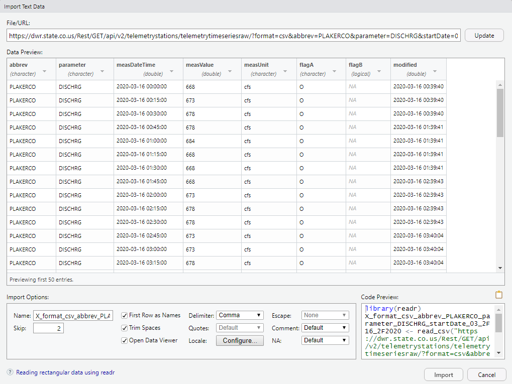

# examples/r

This folder contains examples of how to link R to the State of Colorado's
HydroBase REST web services.

## Getting Started

[R](https://www.r-project.org/) is a free software environment for statistical
computing and graphics. R does not come standard and will need to be downloaded
onto a local machine before anything else. If R is not install, install it by
going to the [R Project](https://www.r-project.org/).

**Note:** This example does not take into account querying issues unlike some
other examples in this repository such as HydroBase paging
([learn more here](../../README.md#introduction)) and missing values
from the data. It is only meant to be an introduction to retrieving data from
the web server and being able to manipulate it from there.

### Using RStudio to Import a Data Set from a URL

RStudio is a GUI designed to help be more productive with R, and is very simple to
use for obtaining data from a web site. It requires an R version of 3.0.1 or
higher to run, so keep that in mind. To install RStudio, visit the
[RStudio Website](https://rstudio.com/products/rstudio/download/). The rest of the
steps are as follows:

* Once RStudio is installed, open it up

* In the upper right hand corner of RStudio is the environment panel which will
claim `Environment is empty`. A part of that environment panel is a button that
reads Import Dataset; Click on that, followed by `From Text (readr)...`

* Enter the URL for the query, which can be built on the
[CDSS REST help website](https://dwr.state.co.us/rest/get/help)

* Clicking update in the upper right will show you a data preview. Extra options can
be changed, and then the data can be imported using the Import button.

Below is a screenshot of querying the HydroBase web service using the PLAKERCO Telemetry Station, DISCHRG parameter in a CSV format.
****

****
