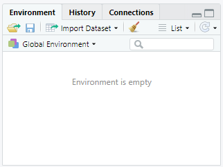

# examples/r

This folder contains examples of how to use R with the State of Colorado's
HydroBase REST web services.

* [Getting Started](#getting-started)
	+ [Using RStudio to Import a Dataset from a URL](#using-rstudio-to-import-a-dataset-from-a-url)
* [TSTool R Integration](#tstool-r-integration)

--------------

## Getting Started

[R](https://www.r-project.org/) is a free software environment for statistical computing and graphics.
If not already installed, R will need to be downloaded and installed onto a local computer.
Download R from the [R Project](https://www.r-project.org/) website and install using
instructions on that website.

**Note:** Unlike other examples in this repository,
this R example does not take into account querying issues as paging and handling missing values.
See the ([main README](../../README.md#introduction)) for general information about web services.
This example is only meant to be an introduction to retrieving data from web services.

### Using RStudio to Import a Dataset from a URL

RStudio is a graphical user interface (GUI) designed to help be more productive with R,
and provides features to download data from a web service or other web address.
RStudio requires an R version of 3.0.1 or higher to run.
To install RStudio, visit the [RStudio website](https://rstudio.com/products/rstudio/download/).
The rest of the steps are as follows:

* Once RStudio is installed, start it.

* In the upper right hand corner of RStudio is the ***Environment*** tab.
In the ***Environment*** tab, click on ***Import Dataset / From Text (readr)...***.



* Enter the URL for the query, which can be formatted using the URL builder tools on the
[CDSS REST help website](https://dwr.state.co.us/rest/get/help).
For example, to read real-time streamflow for station `PLAKERCO`, use the following telemetry station URL.
The `csv` format is requested in order to import as a tabular dataset.

```
https://dwr.state.co.us/Rest/GET/api/v2/telemetrystations/telemetrytimeseriesraw/?format=csv&abbrev=PLAKERCO&parameter=DISCHRG
```

* Click the ***Update*** button in the upper right to retrieve the data and display in the preview area.
The ***Import Options*** can be set as needed to handle the data format,
and then the data can be imported using the ***Import*** button.

The following image illustrates the settings necessary to skip over the extra heading lines and properly import the data
(need to skip the first 2 rows that are used for paging).


Additional R and RStudio features can be used to analyze and visualize the data.

## TSTool R Integration

TSTool implements features to list and access web services data.
These features can be used to streamline data processing and then integrate with R for analysis
using the TSTool [`RunR`](http://opencdss.state.co.us/tstool/latest/doc-user/command-ref/RunR/RunR/) command.
See also the [TSTool examples](../tstool/README.md).
