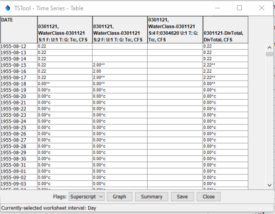

# examples/tstool

This folder contains examples of how to access HydroBase REST web services using TSTool software.

* [Introduction](#introduction)
* [Examples](#examples)
	+ [Download data to a file with `WebGet` command](#download-data-to-a-file-with-webget-command)
	+ [Download data and read into a table](#download-data-and-read-into-a-table)
	+ [Download time series for streamflow telemetry station](#download-time-series-for-streamflow-telemetry-station)
	+ [Download daily diversion time series for a structure](#download-daily-diversion-time-series-for-a-structure)
	+ [Download monthly diversion time series for a structure](#download-monthly-diversion-time-series-for-a-structure)
	+ [Download annual diversion time series for a structure](#download-annual-diversion-time-series-for-a-structure)
	+ [Download call data as table and time series](#download-call-data-as-table-and-time-series)

----------------------

## Introduction ##

The CDSS TSTool software can be used to automate processing time series and other data.
TSTool and StateDMI are the main tools used to create CDSS StateCU and StateMod model datasets.
However, TSTool can also be used for general data processing.
TSTool can be run in interactive or batch modes.

* See the [OpenCDSS TSTool website](http://opencdss.state.co.us/opencdss/tstool/)

TSTool uses "datastores" to configure data sources including web services.
TSTool version 13 and later is distributed with `HydroBaseWeb` datastore automatically configured,
but with no API key defined in the configuration file.

If an API key is needed, for example to allow processing large datasets,
see the [REST Web Services Help](https://dwr.state.co.us/Rest/GET/Help#TechInfoHelp&#All&#gettingstarted&#jsonxml)
for information about acquiring an API key.
Once the API key is acquired, it can be added to the
[TSTool datastore configuration file](http://opencdss.state.co.us/tstool/13.02.00dev/doc-user/datastore-ref/ColoradoHydroBaseRest/ColoradoHydroBaseRest/).
**Note that TSTool version 13+ must be run at least one time to ensure that folders and files are initialized for that version,
before updating the datastore configuration file.**

From the TSTool interface, use the ***View / Datastores*** menu to view the list of configured datastores.
Datastores that have configuration issues should be highlighted in yellow.
The `HydroBaseWeb` datastore should be included in the list of datastores.

See the [TSTool ColoradoHydroBaseRest Datastore documentation](http://opencdss.state.co.us/tstool/latest/doc-user/datastore-ref/ColoradoHydroBaseRest/ColoradoHydroBaseRest/)
for information about the datastore, including list of available data.
Additional time series will be enabled as web services and TSTool features are updated.

Considerations when using TSTool with HydroBase web services include:

* **Slower performance than direct database read:**
	+ Web services will be slower than direct database connections.
	This is particularly an issue when interacting with commands that attempt to run in "discovery"
	mode in order to provide lists of time series for command editors.
	TSTool will continue to be updated to improve performande;
	however, for heavy data processing
	it may be necessary to edit command files in a text editor and then run with TSTool.
	+ Running a TSTool command file will re-execute the commands.
	Therefore if any command read HydroBase web services, the time to run will be impacted by the data read.
	It can be beneficial to spit processing into download and command file and separate data processing command file.
	This is more important for large data sets and in cases where API key limits may be exceeded because of
	repeated downloads.
* **Different results** - Using TSTool in some cases will result in data different from basic web service queries.
For example, diversion records processed by TSTool may have additional zeros because of software
logic agreed to with the State of Colorado, consistent with common practices in using diversion records.
Additional filled zero values are flagged and can be viewed in TSTool table and graph views,
and will be output in some formats such as the `DateValue` format.
**Funding has been allocated to address this issue starting July, 2020.**

## Examples ##

The following sections describe specific examples that use TSTool to access HydroBase REST web service data.
Links are provided to access repository example files, which can be downloaded and run using TSTool.

### Download data to a file with `WebGet` command ###

Example files:  [example-webget](example-webget)

The TSTool [`WebGet` command](http://opencdss.state.co.us/tstool/latest/doc-user/command-ref/WebGet/WebGet/),
found in the ***File Handling*** commands, can
be used to retrieve any content available on a website using a URL.
This is useful for bulk download of data.
Because other software will need to process the file, choose a data format that can be processed,
such as comma-separated-value (CSV).

### Download data and read into a table ###

Example files:  [example-table](example-table)

If a CSV file has been downloaded, it can be read into a table and used for further processing.
For example, this example:

1. gets the list of active structures in water district 3 and saves to a CSV file
2. read the CSV file into TSTool table
3. copies only the `DITCH` structures into another table (because web services don't allow filtering on structure type)
4. loops over the rows in the table using the TSTool
[`For` command](http://opencdss.state.co.us/tstool/latest/doc-user/command-ref/For/For/) command

This basic logic can be used to iterate through lists of structures, stations, or other data to
automate data download, quality control, etc.

### Download time series for streamflow telemetry station ###

Example files:  [example-streamflow](example-streamflow)

Telemetry stations are locations where real-time data are collected.
Data observations are collected from various data networks,
including State of Colorado's Satellite Monitoring System,
third-party data from systems with independent access (e.g., USGS, Northern Water),
and third party data submissions for systems that are not available online
(e.g., communities that share data with the State via HydroBase).
DWR archives third-party so that data can be retrieved to
understand administrative decisions.
However, third-party data are not updated for changes such as data corrections and therefore
the authoritative data source should be used if available for historical studies
(e.g., use USGS historical data).
In addition to providing access to HydroBase, TSTool provides access to USGS web services (for example see the
[`UsgsNwisInstantaneous` datastore](http://opencdss.state.co.us/tstool/latest/doc-user/datastore-ref/USGS-NWIS-Instantaneous/USGS-NWIS-Instantaneous/)
and
[`UsgsNwisDaily` datastore](http://opencdss.state.co.us/tstool/latest/doc-user/datastore-ref/USGS-NWIS-Daily/USGS-NWIS-Daily/).

Streamflow data are used for real-time operational decisions such as evaluating
whether water can be diverted in priority and to monitor environmental flow conditions.
Other data types (parameters) such as reservoir level, water temperature, and other parameters are available at some stations.
Real-time telemetry station data should be considered provisional data.

**Note that HydroBase historical station data are not yet available as web services and are therefore
are not available in TSTool.  Historical data have typically received additional scrutiny
and are suitable for planning and other studies.**

See the [telemetry station dataset web services](https://dwr.state.co.us/rest/get/help#Datasets&#TelemetryStationsController&#gettingstarted&#jsonxml).
Telemetry station data are made available for multiple intervals (timesteps) and the
default web services period is short to ensure fast data access.
There is latency between original observation and access to the data, due to transmission and data processing time.

* original measurement interval:
	+ varies depending on data collection system (e.g., 5-minute or instantaneous depending on weather events)
	+ is not available through web service
* 15-minute interval (timestep):
	+ data may be a statistic over the interval but are essentially instantaneous or "real time"
	+ see [`telemetrytimeseriesraw` web service](https://dwr.state.co.us/Rest/GET/Help/TelemetryTimeSeriesRawGenerator)
	+ data are useful to inform time-sensitive decisions
	+ streamflow data are useful to understand peak flows (although historical data that is quality controlled is better for long-term data record)
	+ streamflow data are useful to understand environmental flows
	+ data issues will be emphasized as spikes or dips, such as single values that are different than neighboring values
* 1-hour interval (timestep):
	+ data may be a statistic over the interval, for example to create average flow
	+ see [`telemetrytimeserieshour` web service](https://dwr.state.co.us/Rest/GET/Help/TelemetryTimeSeriesHourGenerator)
	+ peaks and dips will be dampened because extreme values will have been distributed across multiple timesteps
* 1-day interval (timestep):
	+ data may be a statistic over the day, for example to create average flow
	+ see [`telemetrytimeseriesday` web service](https://dwr.state.co.us/Rest/GET/Help/TelemetryTimeSeriesDayGenerator)
	+ peaks and dips will be further dampened because extreme values will have been distributed across multiple timesteps
	+ streamflow data are useful for water management
	+ data can be aggregated to larger timestep for historical analysis,
	although quality-controlled historical dataset should be used if available

It can be difficult to understand which parameter should be used for telemetry station data.
Streamflow is recorded using parameter name `DISCHRG`, `DISCHRG1`, `DISCHRG2`, `DISCHRG3`, or `DISCHRG4`.
The parameter that is used depends on the station configuration.
For example, a single gage at a confluence may collect data for each tributary using the same station identifier.
TSTool can help understand the available data by listing all available time series.
For example, select the following in the TSTool interface:

* ***Datastore*** - `HydroBaseWeb`
* ***Data type*** - `Telemetry Station - *`
* ***Time step:*** - `15Min`

Then press ***Get Time Series List***.  Because `*` is specified for the data type,
all available 15-minute time series for the entire State will be listed.
The list can be sorted by station identifier or name to determine which data types (parameters)
are available for the station.

For this example:

1. Set the input period to read data, to override the web service default.
The [`SetInputPeriod` command](http://opencdss.state.co.us/tstool/13.02.00dev/doc-user/command-ref/SetInputPeriod/SetInputPeriod/),
available in the ***Commmands / Read Time Series*** menu,
allows setting the period relative to current time.
2. Read 15-minute `DISCHRG` data , in this case PLAKERCO (SOUTH PLATT RIVER NEAR KERSEY, CO)
using the
[`ReadColoradoHydroBaseRest` command](http://opencdss.state.co.us/tstool/13.02.00dev/doc-user/command-ref/ReadColoradoHydroBaseRest/ReadColoradoHydroBaseRest/),
which is in the ***Commands / Read Time Series*** menu.
3. Read 1-hour `DISCHRG` time series for the station.
4. Read daily `DISCHRG` time series for the station.

TSTool allows viewing time series of different interval on the same graph, as shown below.
The graph has been zoomed to a single storm event and shows how the time series values vary
depending on data interval.

### Download daily diversion time series for a structure ###

Example files:  [example-divrec-day](example-divrec-day)

Daily diversion records are the most detailed diversion record data for a structure.
Diversion records are initially recorded as `WaterClass` records, which indicate details
about the source and destination and use of the data.
Note that web services use the term `WaterClass` for all types of records associated with structures,
including `WaterClass`, `DivTotal`, and other records.
The `WaterClass` records are processed into `DivTotal` records, which record total through a structure,
and `RelTotal`, which indicate total release from a structure, such as storage structures.

Daily diversion records returned from web service contain measurements and user-reported values.
DWR implements a carry-forward algorithm within water years (November to October) that fill missing
values by repeating non-zero measurements.  The DWR approach does NOT fill zero values.
However, TSTool by default fills daily diversion records with additional zeros within irrigation years that
have at least one measurement.  Zeros are filled at the beginning of the irrigation year (before first value)
and by repeating zero values.
TSTool will also optionally set additional zeros for days in irrigation years
when annual diversion comment indicates that water was not taken.
The zero values are flagged.
This approach is consistent with common practice in using diversion records.

To understand `WaterClass` records for a structure of interest,
use the [Water Classes URL Generator](https://dwr.state.co.us/Rest/GET/Help/WaterClassesGenerator) and
query the water classes for the structure, in this case WDID 0301121:
[https://dwr.state.co.us/Rest/GET/api/v2/structures/divrec/waterclasses/?format=jsonprettyprint&wdid=0301121](https://dwr.state.co.us/Rest/GET/api/v2/structures/divrec/waterclasses/?format=jsonprettyprint&wdid=0301121).
The list of available record types (`divrectype` for each water class web service record) indicate which web services can be used to retrieve data.
For example, `divrectype` of `DivTotal` indicates that the `divrecday`, `divrecmonth`, and `divrecyear` web services should be used,
depending on the `availableTimesteps` value in water class list.
TSTool streamlines accessing web services by calling web services as needed and returning data as time series
that can be visualized and processed.

For this example:

1. Read daily `WaterClass` diversion records for the structure WDID, in this case 0301121,
using the
[`ReadColoradoHydroBaseRest` command](http://opencdss.state.co.us/tstool/13.02.00dev/doc-user/command-ref/ReadColoradoHydroBaseRest/ReadColoradoHydroBaseRest/),
which is in the ***Commands / Read Time Series*** menu.
Diversion comments are used to fill missing values with additional zeros.
2. Read daily `DivTotal` diversion records for the structure.
Diversion comments are used to fill missing values with additional zeros.
3. Read daily `RelTotal` diversion records for the structure.
	* The command generates an error for this example because there are no release time series for this structure.
	* The command can be deleted or commented out to avoid generating an error.
4. Read annual `DivComment` diversion records for the structure.
The time series has zeros in years where water was not taken.
	* To graph in TSTool, use a point graph because values are sparse and
	have zero values.

When the command file is run and line graph is viewed in TSTool, it is useful to click on the legend text to highlight a specific time series of interest,
as shown in the following figure.

The TSTool table view (see below) can be used to view the time series data values and flags.
Use the ***Flags: Superscript*** option near the lower left in the table view.
Note that some zero values have been filled using carry forward from an observed zero value,
and that some daily values have been set using diversion comment.

**Note also that daily diversion records read from HydroBase database may have more zeros than data read from web services.
This is because the HydroBase `vw_CDSS_DailyAmt` and `vw_CDSS_DailyWC` views may provide
zero values where data may have been missing, due to how the view is created.
These values typically are zero without a flag.
The HydroBase database design approach is being evaluated and in the future HydroBase may be distributed with fewer zero values,
in which case the fill carry forward default algorithm in TSTool should fill many of those zeros,
especially at the start of the irrigation year.**

### Download monthly diversion time series for a structure ###

Example files:  [example-divrec-month](example-divrec-month)

Monthly diversion records are derived from daily diversion records and
infrequent monthly diversion record data for a structure.
See the discussion of daily data in the previous section
for more information about `WaterClass` and total time series.

Monthly diversion records returned from web service contain measurements and user-reported values.
Unlike daily diversion records, DWR and TSTool DO NOT implement a carry-forward
algorithm within water years (November to October) for monthly diversion records.
TSTool will optionally set additional zeros for months when annual diversion comment indicates that water was not taken.
The zero values are flagged.

To understand `WaterClass` records for a structure of interest,
use the [Water Classes URL Generator](https://dwr.state.co.us/Rest/GET/Help/WaterClassesGenerator) and
query the water classes for the structure, in this case WDID 0301121:
[https://dwr.state.co.us/Rest/GET/api/v2/structures/divrec/waterclasses/?format=jsonprettyprint&wdid=0301121](https://dwr.state.co.us/Rest/GET/api/v2/structures/divrec/waterclasses/?format=jsonprettyprint&wdid=0301121).
The list of available record types (`divrectype` for each water class web service record) indicate which web services can be used to retrieve data.
For example, `divrectype` of `DivTotal` indicates that the `divrecday`, `divrecmonth`, and `divrecyear` web services should be used,
depending on the `availableTimesteps` value in water class list.
TSTool streamlines accessing web services by calling web services as needed and returning data as time series
that can be visualized and processed.

For this example:

1. Read monthly `WaterClass` diversion records for the structure WDID, in this case 0301121,
using the
[`ReadColoradoHydroBaseRest` command](http://opencdss.state.co.us/tstool/13.02.00dev/doc-user/command-ref/ReadColoradoHydroBaseRest/ReadColoradoHydroBaseRest/),
which is in the ***Commands / Read Time Series*** menu.
Diversion comments are used to fill missing values with additional zeros.
2. Read monthly `DivTotal` diversion records for the structure.
Diversion comments are used to fill missing values with additional zeros.
3. Read monthly `RelTotal` diversion records for the structure.
	* The command generates an error for this example because there are no release time series for this structure.
	* The command can be deleted or commented out to avoid generating an error.
4. Read annual `DivComment` diversion records for the structure.
The time series has zeros in years where water was not taken.
	* To graph in TSTool, use a point graph because values are sparse and
	have zero values.

When the command file is run and line graph is viewed in TSTool, it is useful to click on the legend text to highlight a specific time series of interest,
as shown in the following figure.

The TSTool table view (see below) can be used to view the time series data values and flags.
Use the ***Flags: Superscript*** option near the lower left in the table view.
Note that some zero values have been filled using carry forward from an observed zero value,
and that some monthly values have been set using diversion comment.

**Note also that monthly diversion records read from HydroBase database may have more zeros than data read from web services.
This is because the HydroBase `vw_CDSS_AnnualAmt` and `vw_CDSS_AnnualWC` views may provide
zero values where data may have been missing, due to how the view is created.
Unlike daily data tables, the HydroBase database for CDSS does not include observation code for monthly data.
Web services do provide observation code.
The HydroBase database design approach is being evaluated and in the future HydroBase may be distributed with fewer zero values,
in which case some type of fill carry forward for monthly data will need to be implemented in TSTool.**

### Download annual diversion time series for a structure ###

Example files:  [example-divrec-year](example-divrec-year)

Annual diversion records are derived from monthly diversion records and
infrequent monthly and annual diversion record data for a structure.
The year is defined as "irrigation year" November 1 to October 31,
with the numerical year being consistent with the ending calendar year.
Therefore care should be taken when comparing with other year types such as
calendar year or USGS Water Year (October 1 to September 30).
See the discussion of daily data in a previous section
for more information about `WaterClass` and total time series.

Annual diversion records returned from web service contain measurements and user-reported values.
TSTool will optionally set additional zeros for years when annual diversion comment indicates that water was not taken.
The zero values are flagged.

To understand `WaterClass` records for a structure of interest,
use the [Water Classes URL Generator](https://dwr.state.co.us/Rest/GET/Help/WaterClassesGenerator) and
query the water classes for the structure, in this case WDID 0301121:
[https://dwr.state.co.us/Rest/GET/api/v2/structures/divrec/waterclasses/?format=jsonprettyprint&wdid=0301121](https://dwr.state.co.us/Rest/GET/api/v2/structures/divrec/waterclasses/?format=jsonprettyprint&wdid=0301121).
The list of available record types (`divrectype` for each water class web service record) indicate which web services can be used to retrieve data.
For example, `divrectype` of `DivTotal` indicates that the `divrecday`, `divrecmonth`, and `divrecyear` web services should be used,
depending on the `availableTimesteps` value in water class list.
TSTool streamlines accessing web services by calling web services as needed and returning data as time series
that can be visualized and processed.

For this example:

1. Read annual `WaterClass` diversion records for the structure WDID, in this case 0301121,
using the
[`ReadColoradoHydroBaseRest` command](http://opencdss.state.co.us/tstool/13.02.00dev/doc-user/command-ref/ReadColoradoHydroBaseRest/ReadColoradoHydroBaseRest/),
which is in the ***Commands / Read Time Series*** menu.
Diversion comments are used to fill missing values with additional zeros.
2. Read annual `DivTotal` diversion records for the structure.
Diversion comments are used to fill missing values with additional zeros.
3. Read annual `RelTotal` diversion records for the structure.
	* The command generates an error for this example because there are no release time series for this structure.
	* The command can be deleted or commented out to avoid generating an error.
4. Read annual `DivComment` diversion records for the structure.
The time series has zeros in years where water was not taken.
	* To graph in TSTool, use a point graph because values are sparse and
	have zero values.

When the command file is run and line graph is viewed in TSTool, it is useful to click on the legend text to highlight a specific time series of interest,
as shown in the following figure.

The TSTool table view (see below) can be used to view the time series data values and flags.
Use the ***Flags: Superscript*** option near the lower left in the table view.
Note that some zero values have been filled using carry forward from an observed zero value,
and that some year values have been set using diversion comment.

### Download call data as table and time series ###

Example files:  [example-calls](example-calls)

Call data indicate structures that are calling for water because they would otherwise be shorted.
Structures with water rights that are junior to the calling structure are required to curtail diversions.

TSTool does not automatically treat call data as time series.
However, the data can be converted to time series to view the historical occurrence of calls.
The resulting graph is as shown below.

For this example:

1. Download historical call data to a CSV file using the
[`WebGet` command](http://opencdss.state.co.us/tstool/13.02.00dev/doc-user/command-ref/WebGet/WebGet/),
which is in the ***Commands / General - File Handling*** menu.
	* The period to query is specified in order to read a historical data period.
	* Specify the division as 1 to limit the number of structures that are processed.
2. Read the table using the 
[`ReadTableFromDelimitedFile` command](http://opencdss.state.co.us/tstool/latest/doc-user/command-ref/ReadTableFromDelimitedFile/ReadTableFromDelimitedFile/),
which is in the ***Commands(Table) / Read Table*** menu.
	* The CSV file `setDateTime` is converted to a date to day precision to facilitate processing.
3. Convert the table to time series for each calling structure using the
[`TableToTimeSeries` command](http://opencdss.state.co.us/tstool/latest/doc-user/command-ref/TableToTimeSeries/TableToTimeSeries/),
which is in the ***Commands(Table) / Table, Time Series Processing*** menu.
	* The administration number is used for the time series value,
	indicating which right in a structure's portfolio of water rights is calling.

The calls can be viewed using a point graph, as shown below,
in this case for several selected structures.
The full dataset in this case has nearly 200 time series and would be difficult to show in the legend.

